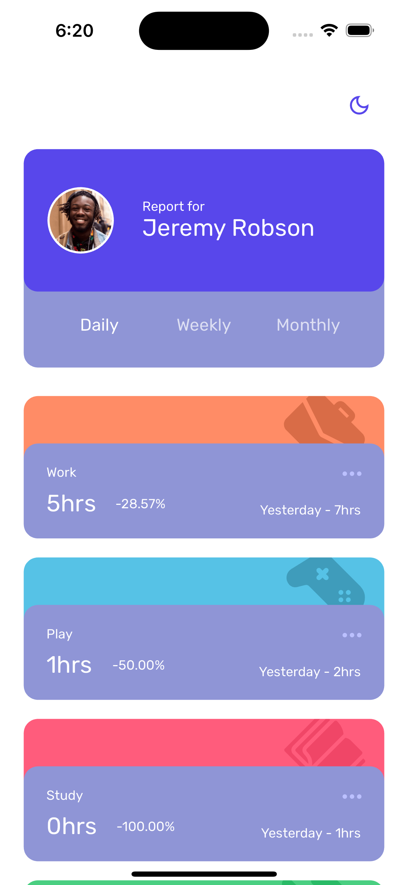
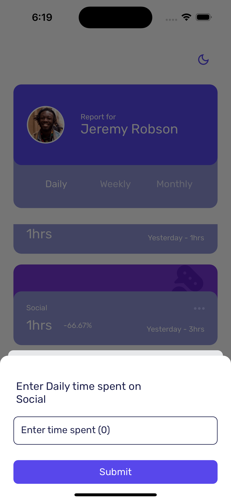
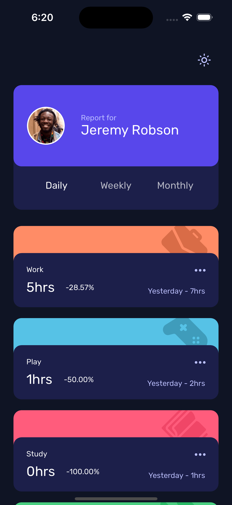
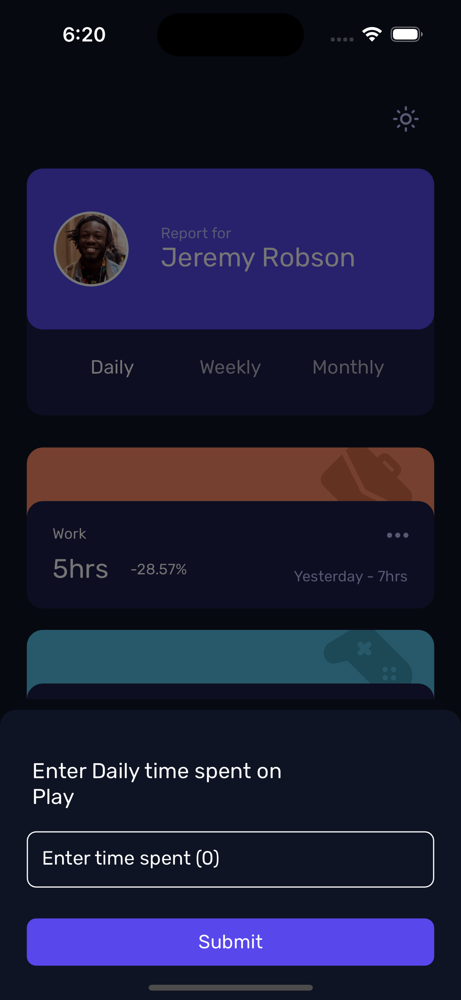

# Time Tracker

This is a simple time tracker app with local storage persistence

## Table of Contents
- [Prerequisites](#prerequisites)
- [Installation](#installation)
- [Usage](#usage)
- [Flavors](#flavors)
- [Screenshots](#screenshots)
- [Issues](#issues)

## Prerequisites

Before you begin, ensure you have met the following requirements:

- [Flutter](https://flutter.dev/docs/get-started/install) installed on your machine.
- [FVM](https://fvm.app/docs/getting_started/installation) installed.

## Installation

1. Clone the repository:

   ```bash
   git clone http://aidhere-gmbh-fkqxjt@git.codesubmit.io/aidhere-gmbh/time-tracker-vfmolm
   ```

2. Ensure you have FVM installed:

     ```bash
   fvm install 3.10.1
   fvm use 3.10.1
    ```


## Usage
To run the project, use the following commands:

### Development
   ```bash
   fvm flutter run -t lib/main_dev.dart
   ```


### Production
   ```bash
   fvm flutter run -t lib/main_prod.dart
   ```

### Build Runner
   ```bash
   fvm flutter pub run build_runner build         
   ```


## Flavors
This project has two flavors: dev and prod. Flavors allow you to build and run the application with different configurations. To switch between flavors, use the appropriate commands mentioned in the [Usage](#usage) section.


## Screenshots



*Home screen (light mode)*


*Enter time spent (light mode)*


*Home Screen (dark mode)*


*Enter time spent (dark mode)*


## Issues
If you have any questions or encounter issues, feel free to open an issue in the GitHub repository.

Happy coding!
